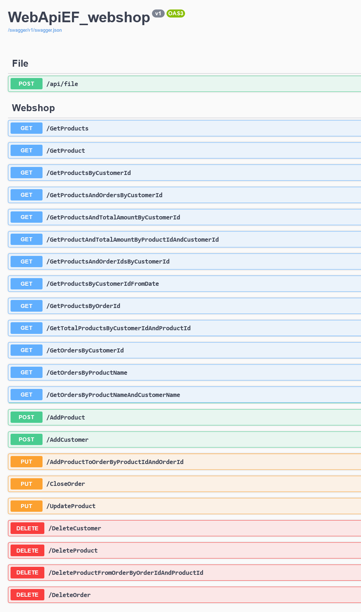

# WebApiEF_webshop_fileupload
Backend application based on ASP.NET Core Web API  project template. The frontend React client is stored in the `react_webshop_fileupload` repository (https://github.com/sztrelcsikzoltan/react_webshop_fileupload)

### Main features

* Processes client requests (HTTP methods) and returns requested data
* Manages products, customers and orders in MySQL database
* Various endpoints available to frontend clients
* Entity Framework Core for smooth data handling
* Receives and saves image file for the product added
* Uses DTOs for optimal data transfer and functionality

  

